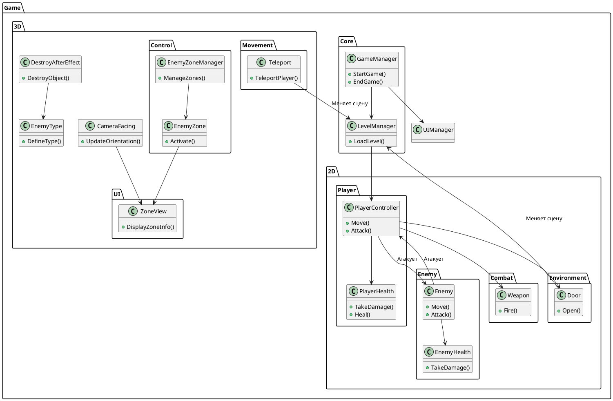

# Душа Ассасина

## 📌 Описание проекта
**Душа Ассасина** — динамичный экшен с элементами платформера и шутера, где игроку предстоит управлять героем, чья душа была изгнана из тела и перенесена в другой мир. Используя свои навыки ближнего и дальнего боя, персонаж должен вернуться в свою реальность и одолеть антагониста.

## 🎮 Геймплей

- **2D-сцена:** классический платформер с ближним боем.
- **3D-сцена:** бои с дальними атаками и сложной механикой насыщения + усиления противников.
- **Интерактивные элементы:** двери, телепорты, ловушки.

## 🛠️ Техническая реализация

### 📂 Архитектура кода
Проект разделен на логические модули:

- **Core** — управление игровым процессом, уровни, UI.
- **2D** — скрипты для платформера.
- **3D** — скрипты для трёхмерной части игры.
- **Combat** — боевые механики.
- **Movement** — системы передвижения.

### 🔗 Связи между компонентами



🚀 Запуск проекта

1. **Клонируйте репозиторий:**
  ```bash
   git clone https://github.com/BashkaCoder/TestTask_FamilyTeam.git
  ```

2. **Откройте проект в Unity (версия 6.0000.34f1 и выше).**
3. **Запустите сцену `2D.unity` в редакторе.**

## 📸 Скриншоты
Скриншот_1 
Скриншот_2 

## 📌 Контакты
- **Автор:** [Башинский Д.О.](https://t.me/dbashinskiy)
- **Почта:** dbashinskiy@miem.hse.ru

## 📜 Лицензия
Этот проект распространяется под лицензией MIT. Свободно используйте, изменяйте и дополняйте ;)
